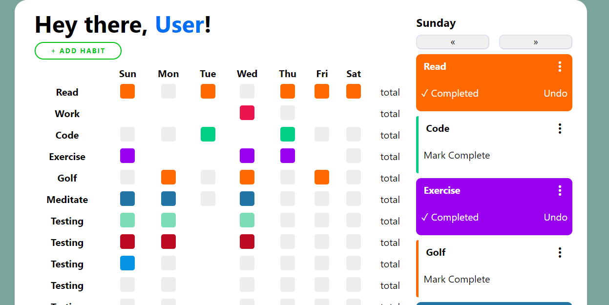
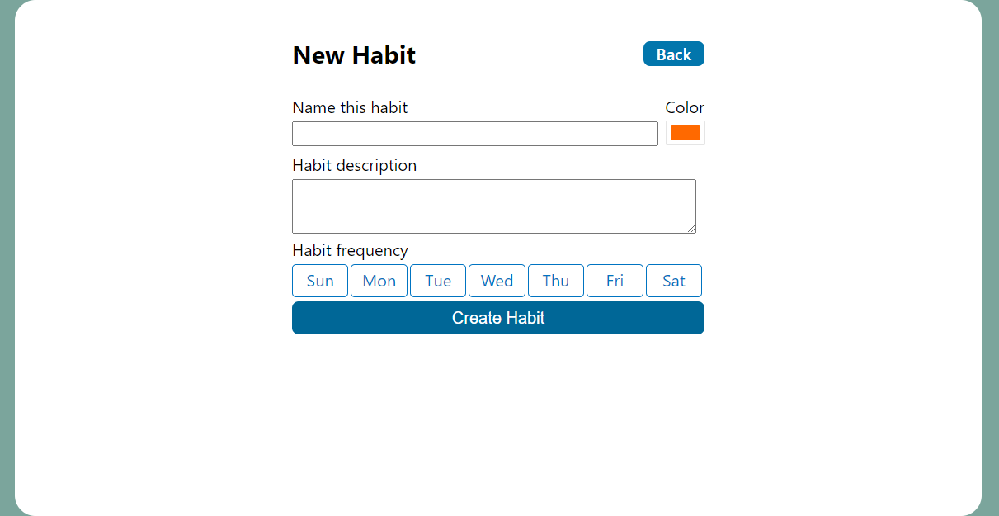

# Habit Tracking App

A weekly dot chart which the user can mark off for days they completed a habit. 

 ## Links
 - [Deployment](https://habit-tracker-one.vercel.app/) 
 
 ## Project Screenshots
 
### Dashboard:

### Create a new habit:

Habits will be made on this page. Edit habit has a similar view. A habit would include a title, a description, and a frequency (in this case, the user can select which days of the week they’d like to do this habit).
 
 ## Technology
 ### Built with:
 - Next.js
 - ReactJS   
 - Node.js
 - PostgreSQL 
 - Knex.js 
 - Express.js 
 - CORS
